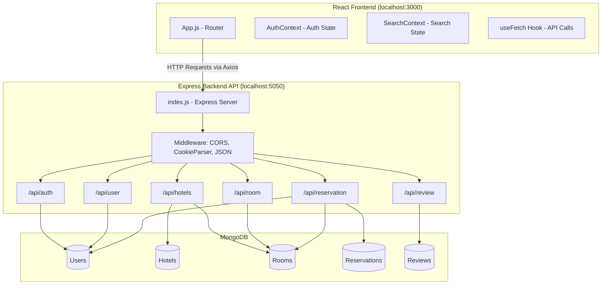
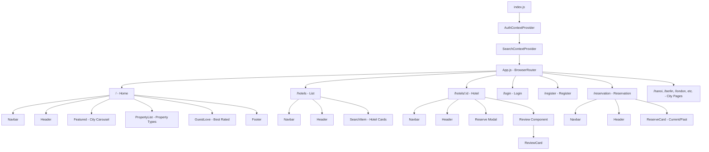
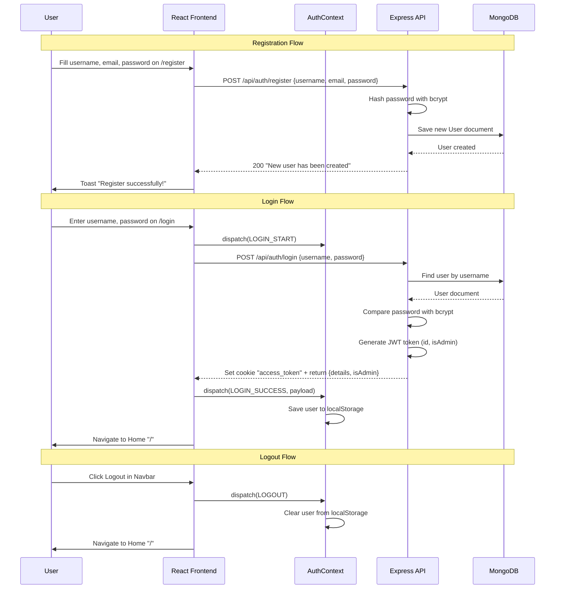
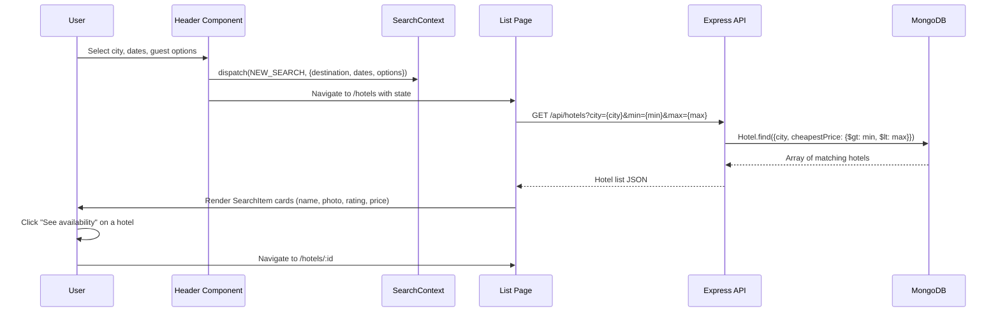
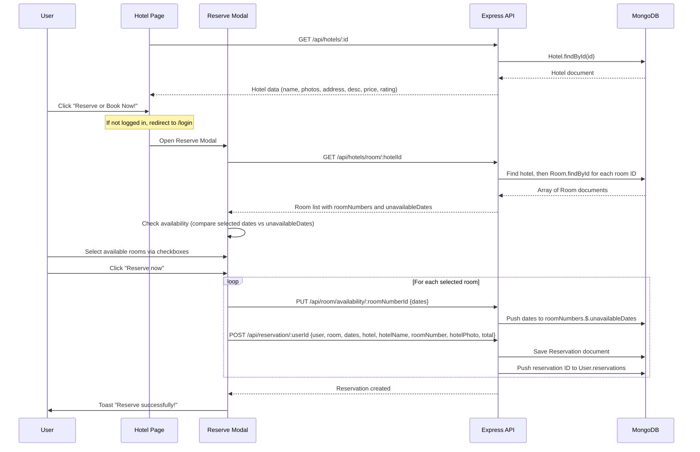
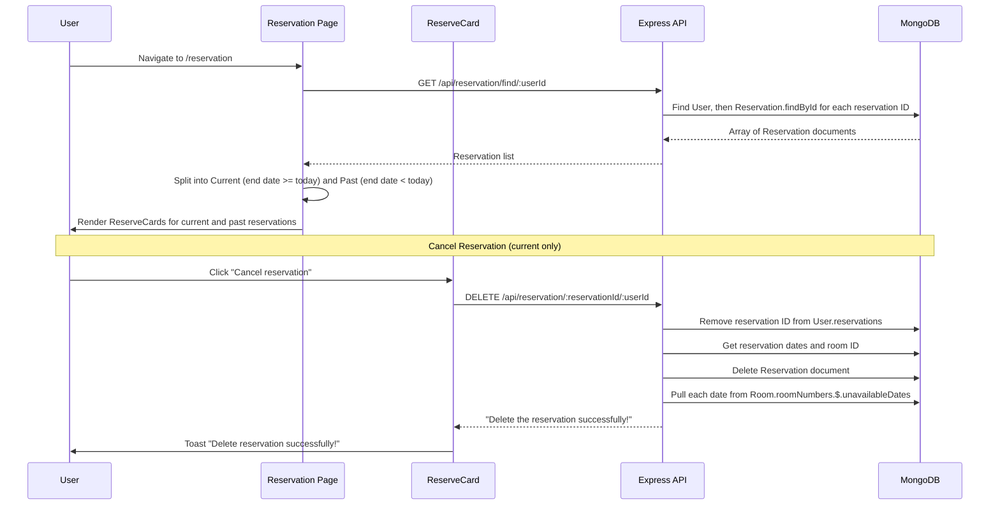
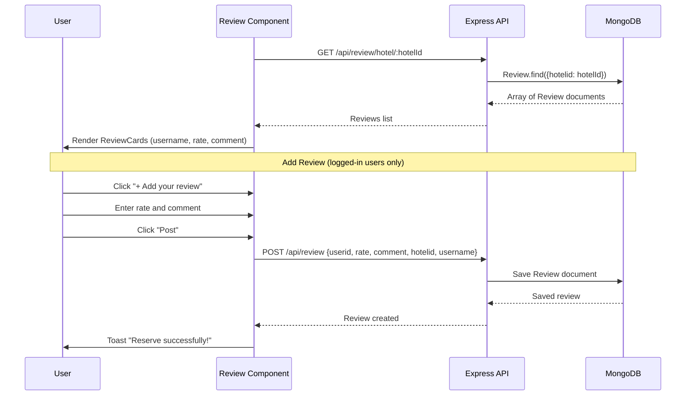
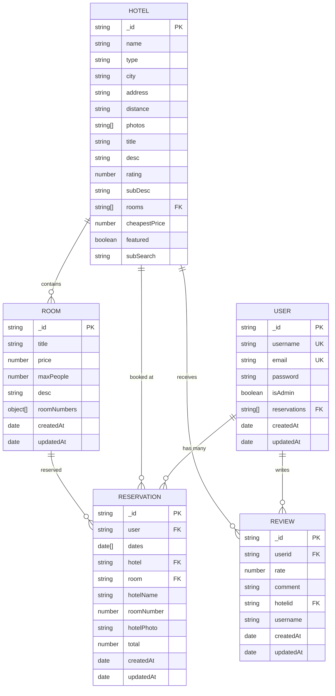
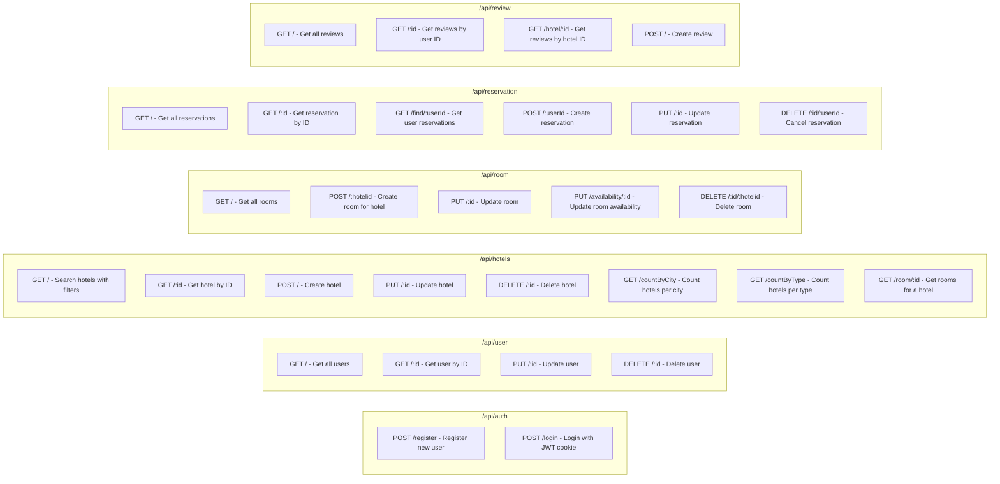
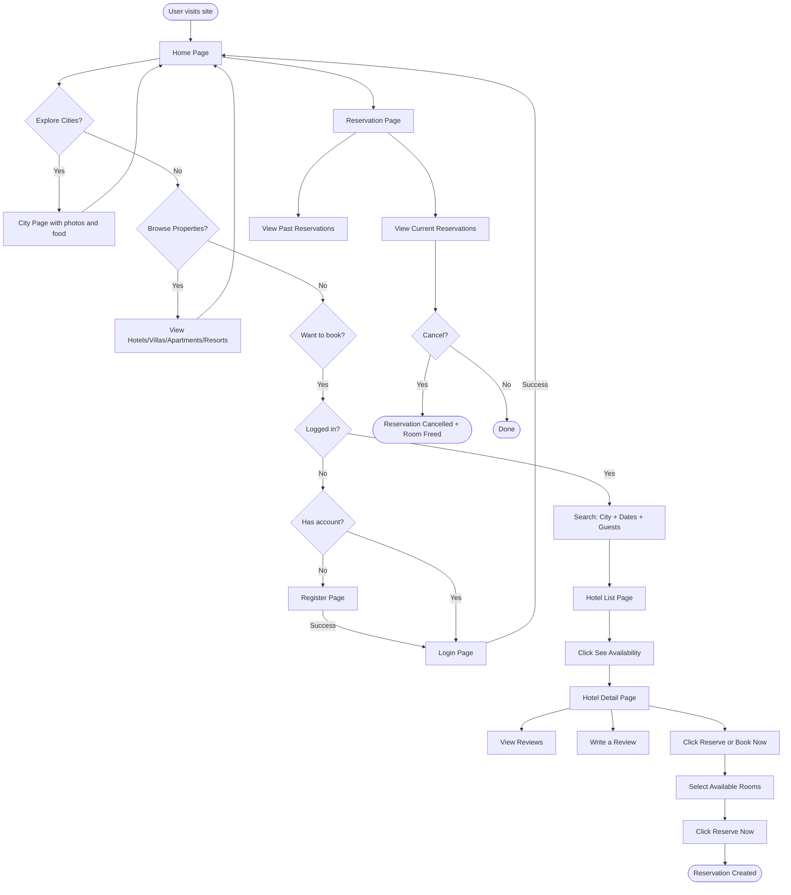

# Hotel Management System - Complete Workflow

## 1. System Architecture Overview



## 2. Frontend Component Hierarchy



## 3. User Authentication Flow



## 4. Hotel Search and Browsing Flow



## 5. Hotel Detail and Room Reservation Flow



## 6. Reservation Management Flow



## 7. Review System Flow



## 8. City Exploration Flow

```mermaid
graph LR
    Home[Home Page] --> Featured[Featured Carousel - Swiper]
    Featured --> Hanoi[/hanoi]
    Featured --> Budapest[/budapest]
    Featured --> Tucson[/tucson]
    Featured --> Dongha[/dongha]
    Featured --> NewYork[/newyork]
    Featured --> LA[/la]
    Featured --> Seattle[/seattle]
    Featured --> Berlin[/berlin]
    Featured --> London[/london]

    Hanoi --> CityPage[City Page: Photos, Description, Food Recommendations]
    Budapest --> CityPage
    Tucson --> CityPage
    Dongha --> CityPage
    NewYork --> CityPage
    LA --> CityPage
    Seattle --> CityPage
    Berlin --> CityPage
    London --> CityPage
```

## 9. Data Models (Entity Relationship Diagram)



## 10. API Routes Summary



## 11. Complete User Journey


