# Hotel Booking Application - Workflow Diagram

## 1. High-Level System Architecture

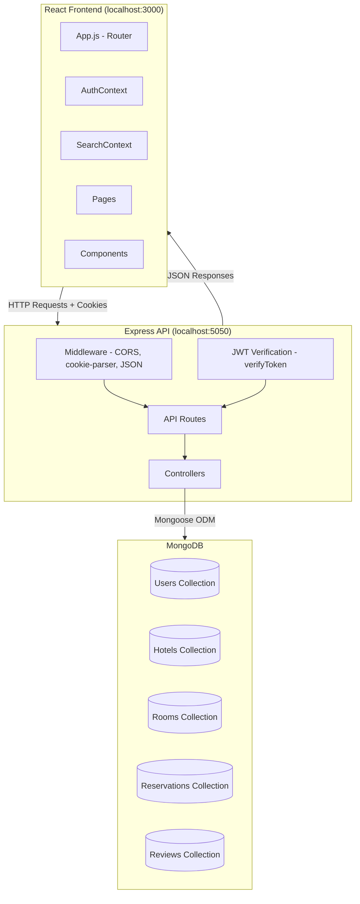

## 2. Authentication Flow

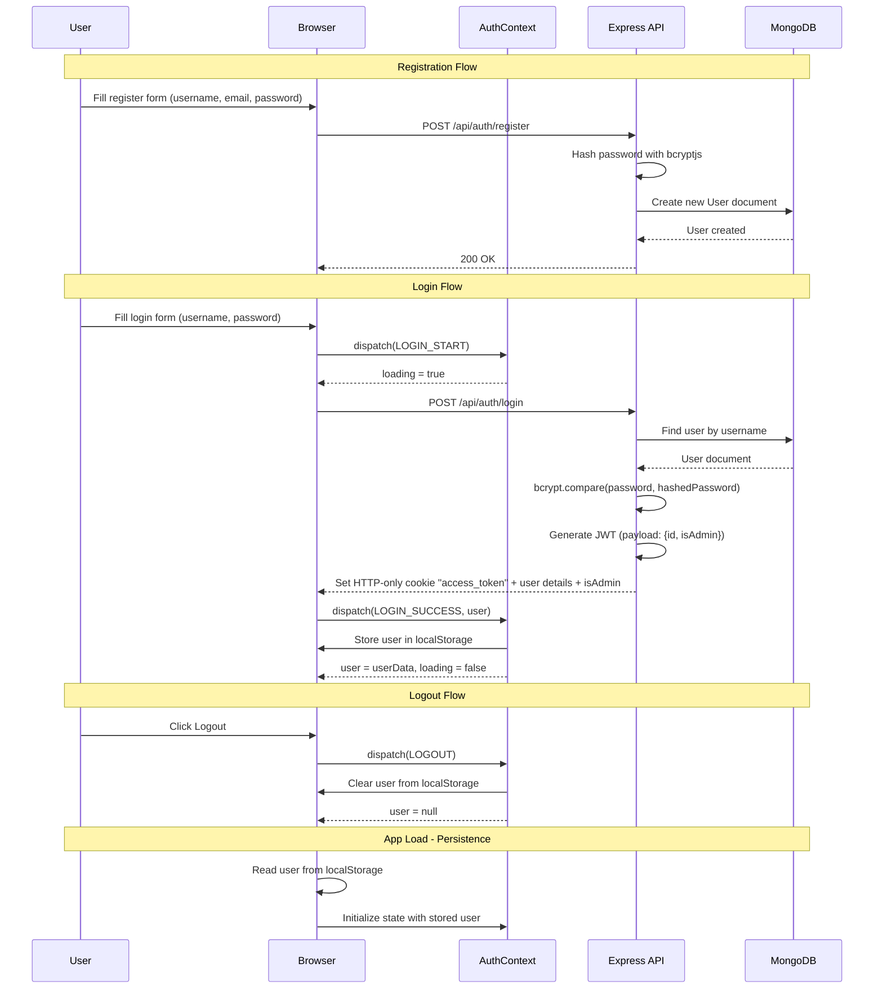

## 3. Hotel Search and Browsing Flow

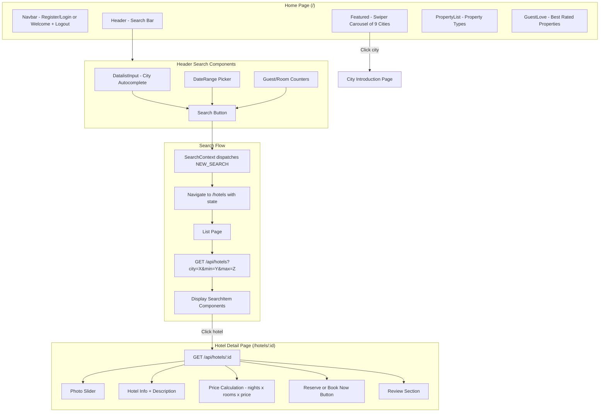

## 4. Room Reservation Booking Flow

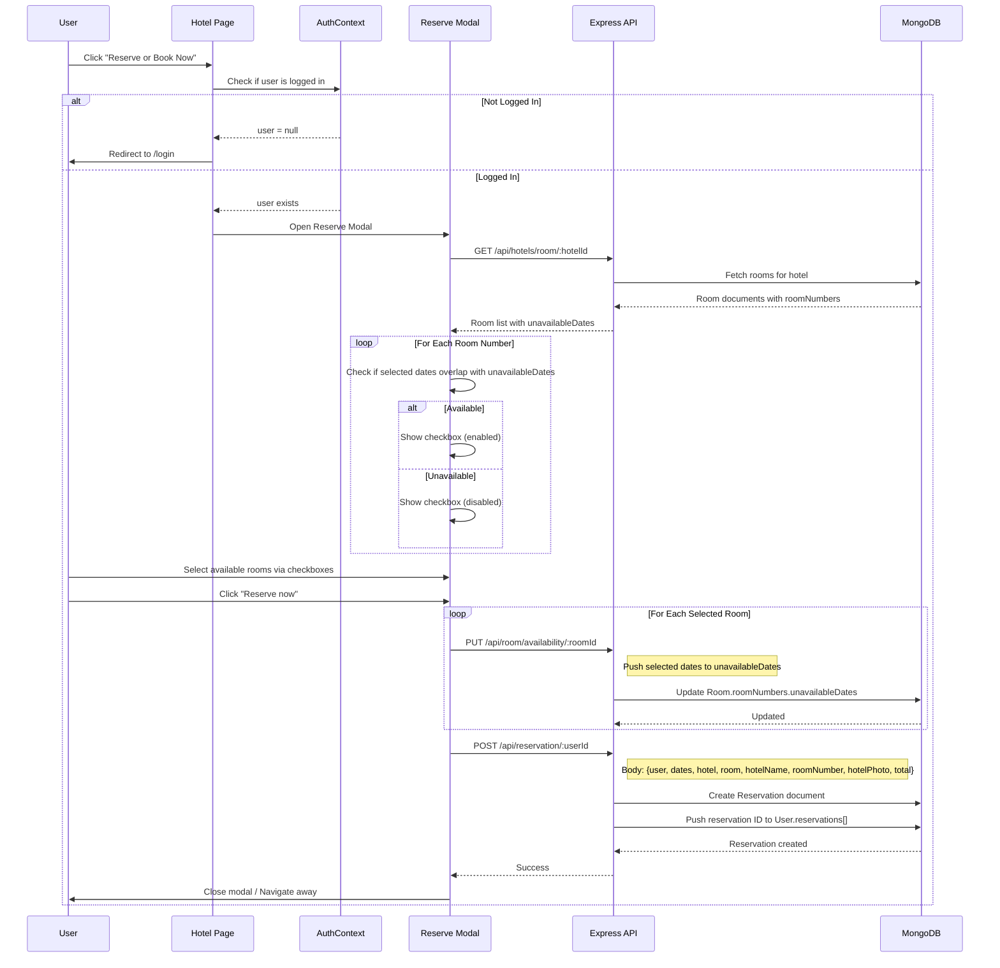

## 5. Reservation Management Flow

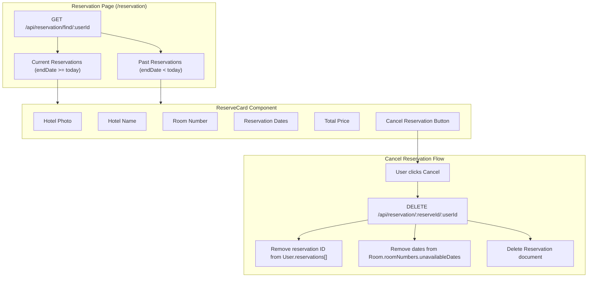

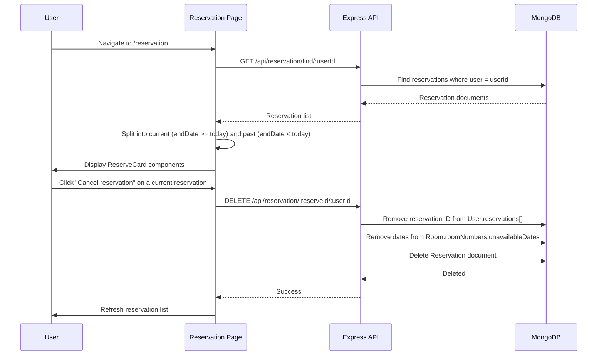

## 6. Review System Flow

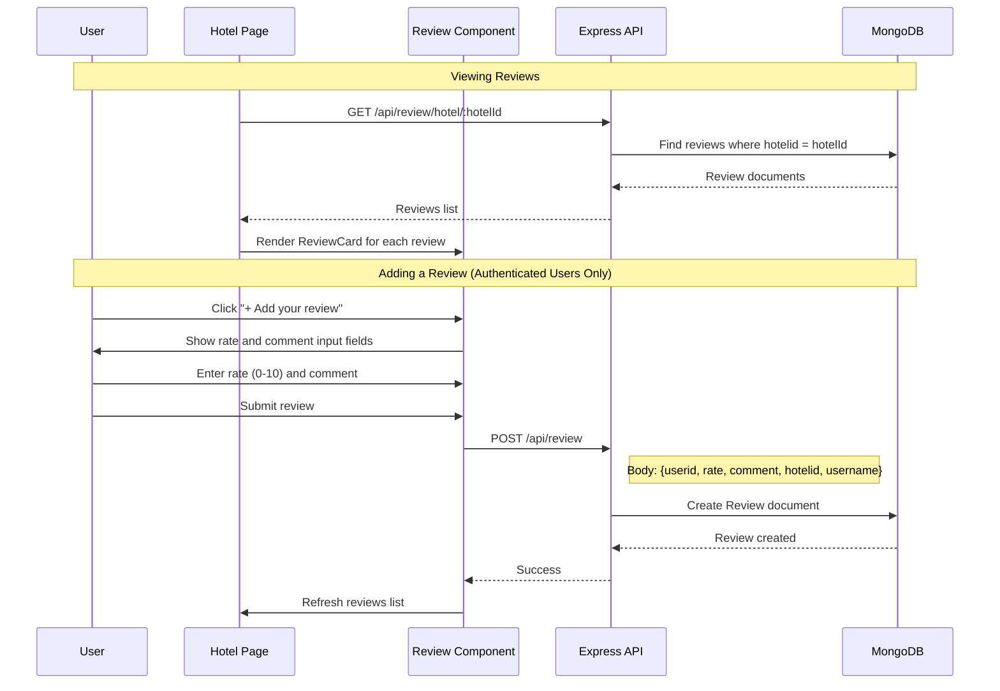

## 7. Data Model Relationships (ER Diagram)

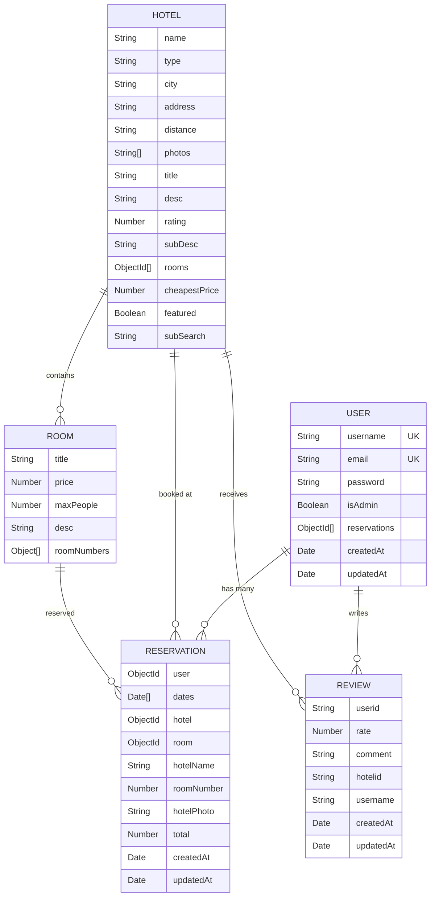

## 8. Frontend Component Architecture

```mermaid
graph TD
    App[App.js - BrowserRouter]

    subgraph Routes["Routes"]
        Home["/ - Home Page"]
        List["/hotels - List Page"]
        HotelPage["/hotels/:id - Hotel Page"]
        Login["/login - Login Page"]
        Register["/register - Register Page"]
        Reservation["/reservation - Reservation Page"]
        CityPages["/hanoi, /dongha, /tucson, /budapest, /newyork, /la, /seattle, /berlin, /london"]
    end

    subgraph SharedComponents["Shared Components"]
        Navbar["Navbar"]
        Header["Header"]
        Footer["Footer"]
    end

    subgraph HomeComponents["Home Page Components"]
        Featured["Featured (Swiper Carousel)"]
        PropertyList["PropertyList"]
        GuestLove["GuestLove"]
    end

    subgraph HotelComponents["Hotel Page Components"]
        Reserve["Reserve Modal"]
        Review["Review Component"]
    end

    subgraph ListComponents["List Page Components"]
        SearchItem["SearchItem"]
    end

    subgraph ReservationComponents["Reservation Components"]
        ReserveCard["ReserveCard"]
    end

    subgraph StateManagement["State Management (Context API)"]
        AuthContext["AuthContext (useReducer)"]
        SearchContext["SearchContext (useReducer)"]
    end

    App --> Routes
    Home --> Navbar
    Home --> Header
    Home --> Featured
    Home --> PropertyList
    Home --> GuestLove
    Home --> Footer
    List --> Navbar
    List --> Header
    List --> SearchItem
    HotelPage --> Navbar
    HotelPage --> Header
    HotelPage --> Reserve
    HotelPage --> Review
    Reservation --> Navbar
    Reservation --> ReserveCard

    AuthContext -->|"user, loading, error"| Navbar
    AuthContext -->|"user"| HotelPage
    AuthContext -->|"user"| Reservation
    SearchContext -->|"city, dates, options"| Header
    SearchContext -->|"search state"| List
```

## 9. Complete API Routes Summary

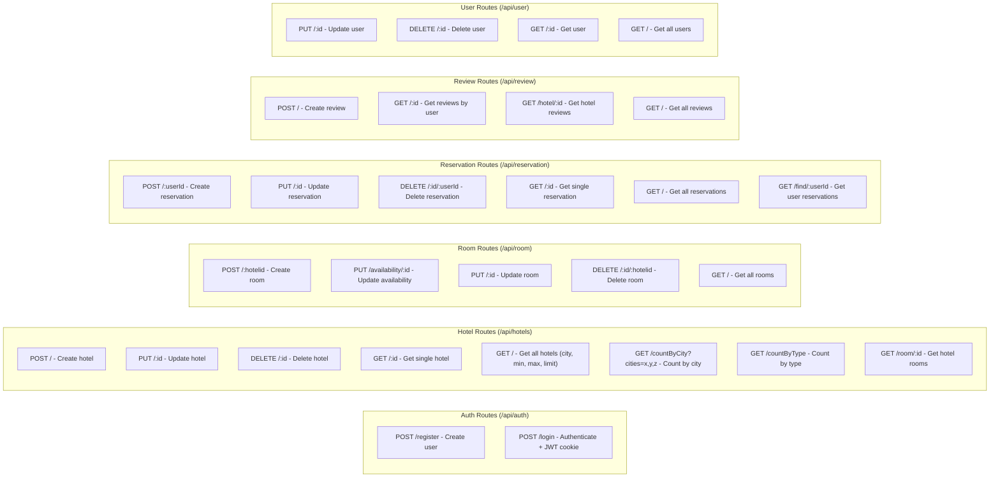

## 10. City Introduction Pages

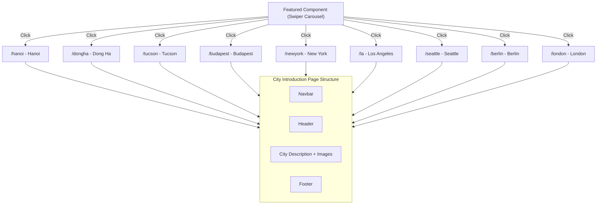
